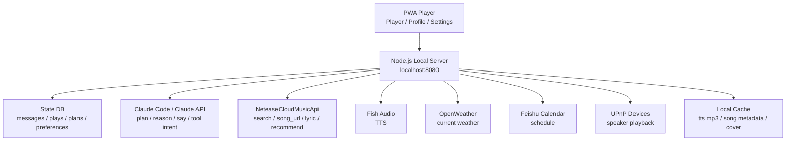

# AI 音乐电台开发文档

## 1. 开发目标

实现一个本地优先的 AI 音乐电台系统：

- 前端：PWA 播放器，运行在浏览器或手机添加到桌面。
- 后端：Node.js 本地服务器，负责音乐、AI、TTS、日历、天气、UPnP 和状态管理。
- AI 编排：Claude 作为大脑，根据上下文生成播放计划、工具调用和 DJ 串词。
- 第三方能力：网易云音乐、Fish Audio、飞书日历、OpenWeather、UPnP。

## 2. 总体架构



系统分四层：

1. 外部上下文层：用户品味语料、Claude、网易云、声音/日历/天气/UPnP。
2. 本地大脑层：路由分流、上下文组装、Claude 适配、任务调度、TTS 管线、状态库。
3. 运行时聚合层：每次触发时组装 prompt，执行工具调用，生成播放计划。
4. 交互层：PWA 前端和 HTTP/WebSocket API。

## 3. 推荐技术栈

### 3.1 前端

- Vite
- React
- TypeScript
- Zustand 或 Redux Toolkit
- React Router
- Tailwind CSS 或 CSS Modules
- Workbox 或 Vite PWA
- Web Audio API / HTMLAudioElement

### 3.2 后端

- Node.js 20+
- TypeScript
- Fastify 或 Express，推荐 Fastify
- better-sqlite3 或 SQLite + Prisma
- zod 做请求校验
- node-cron 做调度
- ws 或 Fastify WebSocket
- undici/fetch 调用外部 API

### 3.3 本地存储

- SQLite：结构化状态、播放历史、计划、配置。
- 文件缓存：TTS MP3、封面、歌词快照。
- Markdown 用户语料：taste.md、routines.md、mood-rules.md。

## 4. 目录结构

```text
ai-radio/
  apps/
    web/
      src/
        pages/
          PlayerPage.tsx
          ProfilePage.tsx
          SettingsPage.tsx
        components/
        stores/
        api/
        audio/
        styles/
      public/
      vite.config.ts
    server/
      src/
        index.ts
        config.ts
        routes/
          now.ts
          plan.ts
          intent.ts
          player.ts
          settings.ts
          profile.ts
          stream.ts
        services/
          claude.service.ts
          context.service.ts
          ncm.service.ts
          tts.service.ts
          weather.service.ts
          calendar.service.ts
          upnp.service.ts
          scheduler.service.ts
        db/
          schema.sql
          db.ts
        prompts/
          dj-persona.md
          plan-system.md
          user-context-template.md
        cache/
          tts/
          covers/
          lyrics/
      package.json
  user/
    taste.md
    routines.md
    playlists.json
    mood-rules.md
  package.json
  pnpm-workspace.yaml
  README.md
```

## 5. 核心模块职责

### 5.1 PWA Player

职责：

- 展示当前歌曲和 AI DJ 状态。
- 控制播放、暂停、上一首、下一首、进度拖动。
- 展示播放队列。
- 接收用户自然语言指令。
- 通过 WebSocket 接收 now-playing、plan-updated、tts-ready 等事件。
- 支持离线壳加载和基础缓存。

关键状态：

```ts
type PlayerState = {
  nowPlaying: QueueItem | null;
  queue: QueueItem[];
  isPlaying: boolean;
  progressMs: number;
  durationMs: number;
  scene: string | null;
  djStatus: "idle" | "thinking" | "speaking" | "error";
};
```

### 5.2 Router 路由分流

职责：

- 判断用户请求属于播放控制、音乐搜索、计划生成、设置更新还是普通问答。
- 将请求转发给对应 service。
- 对 AI 返回的工具调用做白名单校验。

示例意图：

- `PLAY_CONTROL`
- `GENERATE_PLAN`
- `SEARCH_MUSIC`
- `UPDATE_PREFERENCE`
- `EXPLAIN_CURRENT`
- `CHANGE_SCENE`

### 5.3 Context 组装

每次调用 Claude 前，组装 6 类上下文：

1. 系统提示词：AI DJ 人设、行为边界、输出 JSON 格式。
2. 用户语料：taste.md、routines.md、mood-rules.md。
3. 环境注入：天气、日历、当前时间。
4. 状态记忆：最近播放、跳过、收藏、当前队列。
5. 用户输入：文本指令或系统触发事件。
6. 可执行轨迹：本次允许使用的工具和 API 摘要。

### 5.4 Claude 适配器

职责：

- 调用 Claude API。
- 输出结构化 JSON。
- 重试 JSON 解析失败。
- 限制最大 tokens 和超时时间。
- 将 prompt、response、tool result 记录到 messages。

推荐输出结构：

```ts
type ClaudePlanResponse = {
  summary: string;
  scene: string;
  djLines: Array<{
    position: "before_first_song" | "between_songs" | "after_weather" | "manual";
    text: string;
  }>;
  songs: Array<{
    query?: string;
    songId?: string;
    reason: string;
  }>;
  actions: Array<{
    type: "search_song" | "get_recommend" | "get_weather" | "get_calendar" | "none";
    input: Record<string, unknown>;
  }>;
};
```

### 5.5 NeteaseCloudMusicApi

职责：

- 搜索歌曲：`search`
- 获取播放 URL：`song_url`
- 获取歌词：`lyric`
- 获取推荐：`recommend`
- 获取歌单详情：`playlist_detail`

降级策略：

- URL 为空：换同名歌曲或跳过。
- API 超时：使用缓存元数据。
- 歌词失败：不影响播放。
- 推荐失败：退回用户歌单随机抽样。

### 5.6 TTS 管线

流程：

1. 对 DJ 文本做 hash。
2. 查找 `cache/tts/{hash}.mp3`。
3. 命中则直接返回。
4. 未命中调用 Fish Audio。
5. 保存 MP3 文件。
6. 生成 queue item 插入播放计划。

TTS item：

```ts
type TtsItem = {
  type: "tts";
  id: string;
  text: string;
  audioUrl: string;
  durationMs?: number;
};
```

### 5.7 Scheduler 定时调度

默认任务：

- 07:00 生成早间计划。
- 09:00 刷新天气和日历。
- 每小时检查缓存大小。
- 每天凌晨整理播放历史和用户画像。

调度事件进入同一个 plan pipeline，不单独绕过 Claude。

### 5.8 State DB

建议 SQLite 表：

```sql
CREATE TABLE settings (
  key TEXT PRIMARY KEY,
  value TEXT NOT NULL,
  updated_at TEXT NOT NULL
);

CREATE TABLE messages (
  id TEXT PRIMARY KEY,
  role TEXT NOT NULL,
  content TEXT NOT NULL,
  meta TEXT,
  created_at TEXT NOT NULL
);

CREATE TABLE songs (
  id TEXT PRIMARY KEY,
  source TEXT NOT NULL,
  title TEXT NOT NULL,
  artist TEXT,
  album TEXT,
  cover_url TEXT,
  duration_ms INTEGER,
  raw TEXT,
  updated_at TEXT NOT NULL
);

CREATE TABLE plays (
  id TEXT PRIMARY KEY,
  item_id TEXT NOT NULL,
  item_type TEXT NOT NULL,
  song_id TEXT,
  action TEXT NOT NULL,
  scene TEXT,
  created_at TEXT NOT NULL
);

CREATE TABLE plans (
  id TEXT PRIMARY KEY,
  scene TEXT,
  status TEXT NOT NULL,
  input TEXT,
  output TEXT NOT NULL,
  created_at TEXT NOT NULL
);

CREATE TABLE queue_items (
  id TEXT PRIMARY KEY,
  plan_id TEXT,
  type TEXT NOT NULL,
  song_id TEXT,
  tts_text TEXT,
  audio_url TEXT,
  reason TEXT,
  sort_order INTEGER NOT NULL,
  status TEXT NOT NULL
);
```

## 6. HTTP API 合约

### 6.1 获取当前状态

`GET /api/now`

响应：

```json
{
  "nowPlaying": {
    "id": "queue_1",
    "type": "song",
    "song": {
      "id": "123",
      "title": "Song Name",
      "artist": "Artist",
      "coverUrl": "https://..."
    },
    "audioUrl": "http://localhost:8080/api/media/song/123"
  },
  "queue": [],
  "scene": "morning",
  "djStatus": "idle"
}
```

### 6.2 生成播放计划

`POST /api/plan`

请求：

```json
{
  "trigger": "manual",
  "input": "来点适合写代码的歌",
  "maxSongs": 8,
  "withDj": true
}
```

响应：

```json
{
  "planId": "plan_1",
  "scene": "coding",
  "items": []
}
```

### 6.3 用户自然语言意图

`POST /api/intent`

请求：

```json
{
  "text": "别播太吵的，换成下雨天适合听的"
}
```

响应：

```json
{
  "intent": "CHANGE_SCENE",
  "planId": "plan_2",
  "message": "已切到雨天模式"
}
```

### 6.4 播放控制

`POST /api/player/play`

`POST /api/player/pause`

`POST /api/player/next`

`POST /api/player/previous`

`POST /api/player/seek`

seek 请求：

```json
{ "positionMs": 45000 }
```

### 6.5 设置

`GET /api/settings`

`PUT /api/settings`

敏感字段响应时只返回是否已配置，不回传明文 key。

### 6.6 WebSocket

`GET /ws/stream`

事件：

```ts
type ServerEvent =
  | { type: "now_changed"; payload: NowResponse }
  | { type: "queue_updated"; payload: QueueItem[] }
  | { type: "plan_started"; payload: { planId: string } }
  | { type: "plan_finished"; payload: { planId: string } }
  | { type: "tts_ready"; payload: { itemId: string; audioUrl: string } }
  | { type: "error"; payload: { code: string; message: string } };
```

## 7. 播放队列模型

```ts
type QueueItem =
  | {
      id: string;
      type: "song";
      songId: string;
      title: string;
      artist: string;
      coverUrl?: string;
      audioUrl: string;
      reason?: string;
      status: "pending" | "playing" | "played" | "skipped" | "failed";
    }
  | {
      id: string;
      type: "tts";
      text: string;
      audioUrl: string;
      status: "pending" | "playing" | "played" | "skipped" | "failed";
    };
```

## 8. Prompt 设计

### 8.1 System Prompt 要点

- 你是用户的个人 AI 音乐电台 DJ。
- 目标是生成适合当前场景的播放计划。
- 输出必须是 JSON，不要输出 Markdown。
- DJ 串词要短，每段不超过 60 个中文字。
- 不要引用长段歌词。
- 不要虚构用户隐私信息。
- 工具只能从白名单中选择。

### 8.2 用户上下文模板

```text
当前时间：{{now}}
天气：{{weather}}
今日日程：{{calendar}}
当前场景：{{scene}}
最近播放：{{recentPlays}}
最近跳过：{{recentSkips}}
用户口味：{{tasteMd}}
用户作息：{{routinesMd}}
情绪规则：{{moodRulesMd}}
用户输入：{{input}}
```

## 9. 配置项

环境变量：

```env
SERVER_PORT=8080
DATABASE_URL=file:./data/ai-radio.sqlite
CLAUDE_API_KEY=
CLAUDE_BASE_URL=
CLAUDE_MODEL=
NCM_API_BASE_URL=http://localhost:3000
FISH_AUDIO_API_KEY=
FISH_AUDIO_VOICE_ID=
OPENWEATHER_API_KEY=
OPENWEATHER_CITY=
FEISHU_APP_ID=
FEISHU_APP_SECRET=
```

Settings 页面需要能覆盖大部分配置，并写入 settings 表。环境变量优先级高于数据库设置。

## 10. 安全要求

- 不允许 Claude 直接执行 shell。
- 所有工具调用必须经过后端白名单映射。
- API Key 不进入前端日志。
- settings 接口不返回明文密钥。
- 用户歌单、日历和历史默认只保存在本地。
- 外部请求需要 timeout 和错误码。
- TTS 文本需要长度限制，避免意外成本。

## 11. 错误码

```ts
type ErrorCode =
  | "CLAUDE_CONFIG_MISSING"
  | "CLAUDE_TIMEOUT"
  | "NCM_UNAVAILABLE"
  | "SONG_URL_NOT_FOUND"
  | "TTS_CONFIG_MISSING"
  | "TTS_FAILED"
  | "WEATHER_FAILED"
  | "CALENDAR_FAILED"
  | "UPNP_DEVICE_NOT_FOUND"
  | "INVALID_INTENT"
  | "UNKNOWN_ERROR";
```

前端展示原则：

- 技术错误转为用户可理解文案。
- 音乐 URL 失败时自动跳下一首。
- Claude 失败时使用本地 fallback 推荐。
- TTS 失败时跳过播报，不阻断歌曲播放。

## 12. MVP 开发任务拆分

### 阶段 1：工程骨架

- 初始化 monorepo。
- 创建 web 和 server 两个 app。
- 配置 TypeScript、lint、format。
- 搭建 Fastify server。
- 搭建 Vite React PWA。
- 实现健康检查 `/api/health`。

验收：

- `pnpm dev` 可同时启动前后端。
- 浏览器能打开播放器空状态。
- `/api/health` 返回 ok。

### 阶段 2：播放器和队列

- 实现 Player 页面 UI。
- 实现播放队列 store。
- 实现 HTMLAudioElement 播放控制。
- 实现 `/api/now` 和 player 控制接口。
- 实现 WebSocket 事件推送。

验收：

- 可以播放一条 mock mp3。
- 可以暂停、继续、下一首。
- WebSocket 能同步 now-playing。

### 阶段 3：网易云接入

- 接入 NeteaseCloudMusicApi。
- 实现歌曲搜索。
- 实现歌曲 URL 获取。
- 实现歌词和封面缓存。
- 将搜索结果转换为 QueueItem。

验收：

- 输入关键词能搜索并加入队列。
- 歌曲 URL 失败时自动跳过。

### 阶段 4：Claude 播放计划

- 实现 context.service。
- 实现 claude.service。
- 编写 plan-system prompt。
- 实现 `/api/plan`。
- 将 Claude 输出转换为队列。

验收：

- 输入“适合写代码的歌”能生成包含歌曲 reason 的播放计划。
- JSON 解析失败能自动重试一次。

### 阶段 5：Fish Audio TTS

- 实现 tts.service。
- 实现文本 hash 缓存。
- 将 TTS item 插入队列。
- 前端展示 AI DJ 播报状态。

验收：

- Claude 生成的串词能合成为 mp3。
- 同一串词第二次命中缓存。
- TTS 失败不影响歌曲播放。

### 阶段 6：设置和用户语料

- 实现 Settings 页面。
- 实现 settings API。
- 支持 taste.md、routines.md、mood-rules.md 读取。
- Profile 页面展示用户画像基础信息。

验收：

- 用户能在设置页保存 key 和偏好。
- Claude prompt 能包含用户语料。

### 阶段 7：调度和外部上下文

- 接入天气。
- 接入飞书日历。
- 实现 07:00 早间计划。
- 实现环境上下文注入。

验收：

- 手动触发 morning plan 时包含天气和日程摘要。
- 定时任务产生 plans 记录。

## 13. 测试计划

### 13.1 单元测试

- context.service：上下文拼装完整性。
- claude.service：JSON 解析和重试。
- tts.service：hash、缓存命中、失败降级。
- ncm.service：响应转换和空 URL 处理。

### 13.2 集成测试

- `/api/plan` 从输入到队列生成。
- `/api/player/next` 更新状态和 plays。
- WebSocket 事件是否发送。
- 设置保存后是否生效。

### 13.3 前端测试

- 播放按钮状态切换。
- 队列渲染。
- 指令输入提交。
- 设置页敏感字段脱敏。

## 14. Claude Code 执行提示词

可以把下面这段直接发给 Claude Code：

```text
请根据 PRODUCT_SPEC_AI_RADIO.md 和 DEVELOPMENT_SPEC_AI_RADIO.md 实现 MVP。

优先级：
1. 先搭建 pnpm monorepo，包含 apps/web 和 apps/server。
2. 后端使用 Node.js + TypeScript + Fastify + SQLite。
3. 前端使用 Vite + React + TypeScript，做 PWA 播放器。
4. 先实现 mock 播放队列，再接入真实 NeteaseCloudMusicApi。
5. 所有外部 API 都封装在 services 中，必须有 timeout、错误处理和 fallback。
6. Claude 输出必须走结构化 JSON 解析，不要让模型直接执行代码或 shell。
7. Settings 中的 API Key 不允许明文返回前端。

请按阶段提交，每个阶段保证 pnpm lint、pnpm test 或等价检查可运行。
如果第三方 API Key 缺失，请用 mock provider 保持前端和主流程可演示。
```

## 15. 本地运行预期

```bash
pnpm install
pnpm dev
```

默认服务：

- Web：`http://localhost:5173`
- Server：`http://localhost:8080`
- WebSocket：`ws://localhost:8080/ws/stream`

