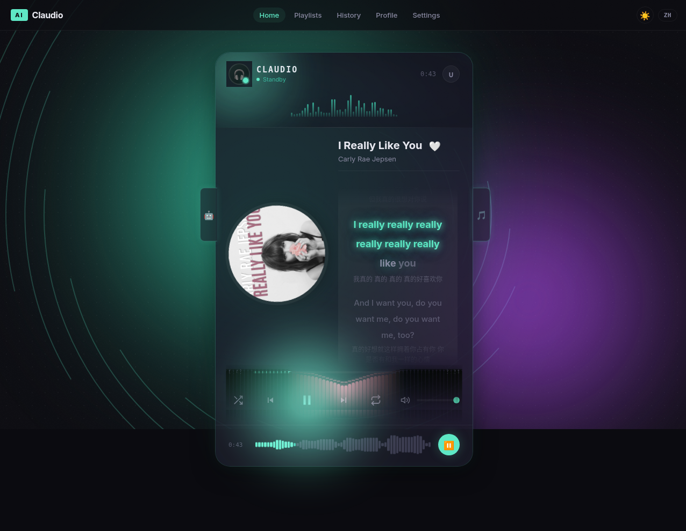

<div align="center">



# 🎧 Claudio — AI Music Radio

**你的私人 AI 音乐电台 · 看场景选歌 · 会说话的 DJ · 封面色随动**

[](https://www.typescriptlang.org/)
[](https://react.dev/)
[](https://fastify.dev/)
[](https://pnpm.io/)
[](https://web.dev/progressive-web-apps/)
[](LICENSE)

把多年歌单蒸馏成一个会看场景、会说话、会选歌的个人 AI 电台。

Claudio 通过 Claude AI 根据你的口味、天气、时段和实时指令生成播放计划与 DJ 串词，再经 Fish Audio 合成语音播报，带来沉浸式电台体验。

</div>

---

## ✨ Features

<div align="center">

| | Feature | Description |
|:---:|:---|:---|
| 🤖 | **AI DJ 串词** | Claude 自动生成主持词、天气提醒、音乐介绍，TTS 语音播报 |
| 🎯 | **场景感知** | 结合天气、时段、日程动态调整音乐风格和推荐 |
| 💬 | **自然语言点歌** | 输入「来点适合写代码的歌」即可调整播放风格 |
| 🎶 | **网易云音乐** | 搜索、播放、逐字歌词、歌单管理、收藏、灰色歌曲解锁 |
| 🎨 | **6 种音频可视化** | Glob / Flower / Arcs / Circles / Wave / Shine |
| 📊 | **封面色频谱** | 频谱颜色跟随封面主题色实时变化，3-stop 渐变 |
| 🖱️ | **鼠标跟随光效** | Cursor Glow 随封面主色变化的光晕跟随鼠标移动 |
| 🎤 | **逐字歌词** | 网易云风格渐变扫描效果，rAF 驱动，零卡顿 |
| 🌙 | **深色/浅色主题** | 一键切换，全面适配 |
| 📱 | **PWA 支持** | 安装到桌面/手机，MediaSession 锁屏控制 |
| 🔒 | **本地私有化** | 核心服务运行在本地，数据全部本地保存 |

</div>

---

## 🚀 Quick Start

### Prerequisites

- **Node.js** >= 18
- **pnpm** >= 9

### 安装 & 启动

```bash
# 克隆仓库
git clone https://github.com/yu727/claudio.git
cd claudio

# 安装依赖
pnpm install

# 一键启动 🎵
./start.sh
```

启动后访问:

| 服务 | 地址 |
|:---|:---|
| **前端** | http://localhost:5173 |
| **后端** | http://localhost:8080 |
| **NCM 代理** | http://localhost:3000 |

---

## 📄 License

MIT
